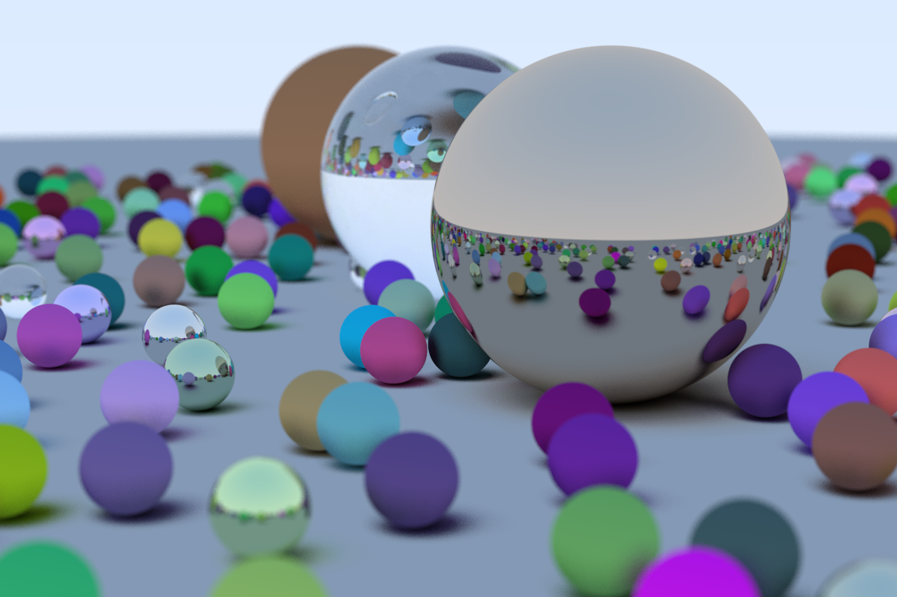

# WoohooRT
A path tracer.

### Note:
This project is WIP. Hoping it will be a good ray tracer soon.

## CPU Ray Tracer:
- Multithread simple ray tracer.
- More on the way :)

## Screenshots
### 1200 x 800
  

## GPU Ray Tracer (Coming Soon):
- Not implemented yet. Planning to implement with DXR(DirectX Ray Tracing).

Run:
Build with visual studio. Go binary file folder and run (syntax can vary between OS's but the command is simple):

```WoohooRT.exe > image.ppm```
